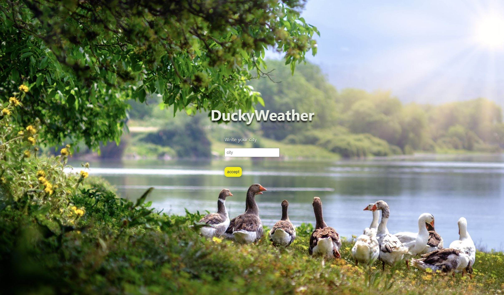
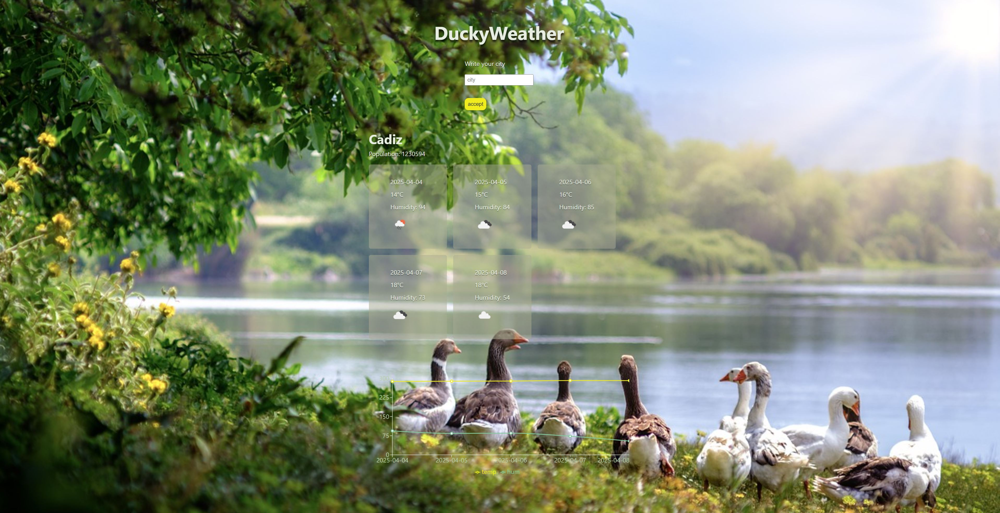

# Proyecto de Previsión del Tiempo con React y OpenWeather 

Este proyecto es una aplicación en React que permite visualizar previsiones meteorológicas utilizando la API de OpenWeather.




## Instalación y puesta en marcha

1. Abre la terminal en la carpeta del proyecto.
2. Accede a la carpeta `client` con el siguiente comando:
   ```
   cd client
   ```
3. Instala las dependencias necesarias ejecutando:
   ```
   npm install
   ```
4. Inicia el proyecto con:
   ```
   npm run dev
   ```

## Obtención de la API Key de OpenWeather
Para obtener una API Key y poder realizar peticiones a OpenWeather, sigue estos pasos:

1. Visita la página de OpenWeather: [https://openweathermap.org/api](https://openweathermap.org/api)
2. Selecciona "Subscribe" en la opción **5 Day / 3 Hour Forecast**.
3. Desplázate hasta encontrar "Free Access, Current weather and forecasts" y haz clic en **Get API Key**.
4. Regístrate en la plataforma y espera a recibir la API Key en tu correo electrónico.
5. En el email, encontrarás la API Key junto con un ejemplo de llamada a la API.

## Configuración del archivo .env

1. Dentro de la carpeta `client` del proyecto, crea un archivo `.env`.
2. Agrega las siguientes variables de entorno:
   ```
   # API de OpenWeather
   VITE_API_WEATHER_KEY=TU_API_KEY_AQUÍ
   VITE_API_WEATHER_URL=https://URL_BASE_DE_LA_API
   ```

## Ejecutar la aplicación

Abre tu navegador y accede a la siguiente dirección:
[http://localhost:5173/](http://localhost:5173/)


# ##############################################################################################


# Weather Forecast Project with React and OpenWeather

This project is a React application that displays weather forecasts using the OpenWeather API.

## Installation and Setup

1. Open the terminal in the project folder.
2. Navigate to the `client` folder:
   ```
   cd client
   ```
3. Install the required dependencies:
   ```
   npm install
   ```
4. Start the project:
   ```
   npm run dev
   ```

## Getting an OpenWeather API Key
To make API requests, you need an API Key. Follow these steps:

1. Visit OpenWeather's website: [https://openweathermap.org/api](https://openweathermap.org/api)
2. Click "Subscribe" under the **5 Day / 3 Hour Forecast** option.
3. Scroll down to "Free Access, Current weather and forecasts" and click **Get API Key**.
4. Create an account and wait for the API Key to arrive via email.
5. In the email, you'll find your API Key along with an example API request.

## Setting up the .env File

1. Inside the project's `client` folder, create a `.env` file.
2. Add the following environment variables:
   ```
   # OpenWeather API
   VITE_API_WEATHER_KEY=YOUR_API_KEY_HERE
   VITE_API_WEATHER_URL=https://BASE_API_URL
   ```

## Running the Application

Open your browser and go to:
[http://localhost:5173/](http://localhost:5173/)

